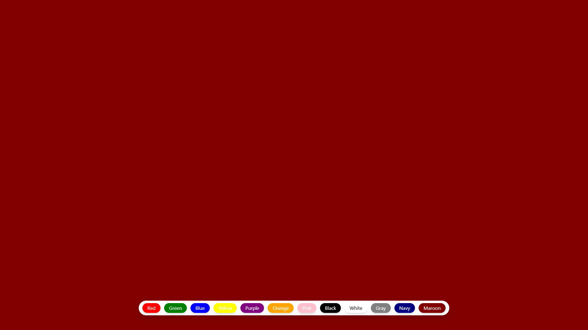

# 🎨 Color Changer App

# Project  [Live Link](https://bg-changer-using-react-murex.vercel.app/)

A simple React application that allows users to change the background color of the screen by clicking on different colored buttons.

---

## 🚀 Features

- 14 different colored buttons to choose from
- Each button changes the background color of the screen
- Built using **React** with **useState** for state management
- Styled with **Tailwind CSS**

---

## 📦 Installation & Setup

1. **Clone the repository**

   ```bash
   git clone https://github.com/raj-0508/color-changer-app.git
   cd color-changer-app

## 🧠 What You Can Learn From This App

📌 State Management
-  ses useState to manage the background color of the app

📌 Event Handling
- Implements onClick handlers for each button to change the background color dynamically

📌 Styling with Tailwind CSS
- Uses Tailwind utility classes for responsive and clean styling

📌 React Component Structure
- Organizes logic, state, and rendering inside a single functional component

📌 JSX Syntax
- Demonstrates how to use JSX to write UI code in JavaScript


## 🎨 Styles
- All styling is handled using Tailwind CSS, ensuring a modern and responsive design.

- Utility classes are applied via the className attribute

- No separate CSS files required

## 💡 Example Use Cases
- A color picker component for design tools

- A theme/background changer for web apps

- Interactive UI component to teach basic React

- Interactive educational tool for color theory

# Screenshot

